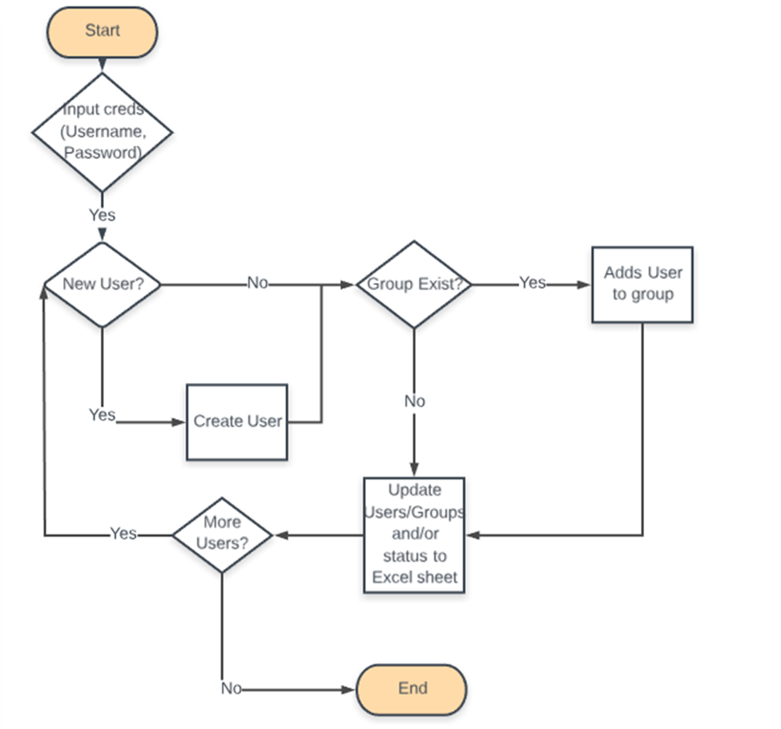

# tableau_automation

Tableau Automation for Adding Users/Groups

#### Running on Python 3.9.4

- can be installed on [Python Website](https://www.python.org/downloads/), [Anaconda](https://www.anaconda.com/download), [pyenv](https://github.com/pyenv/pyenv)

#### Updating pip and installing dependencies/libraries

```bash
python3 -m pip install --upgrade pip
pip install -r requirements.txt
```

### Supported Documentation

- [tableauserverclient](https://tableau.github.io/server-client-python/docs/)

- [python-sdk-smartsheet](https://smartsheet-platform.github.io/smartsheet-python-sdk/)

### What is the purpose of this script?

The purpose of this program is to create users, give site roles [Explorer or Explorer (Can Publish)], and to add users to specific groups in Tableau. This program retrieves user information from Smartsheet.

### Workflow Diagram



### What do you need prepare when running this script?

- Smartsheet Administrator Token

- Smartsheet Sheet ID

- Column IDs (such as the Status Column & the Checkbox Column)

- Must be an Administrator on the Tableau Server

### All functions created in the script

#### smartsheet_data()

- pulls smartsheet data from given Admin Token and returns the class User which contains **username, site_role, group, row_id, Check**

#### update_rows(text, row_id, column_id)

- Parameters: text, row_id, column_id=8024982304384900

  - _text_ is the updated text of the 'Status' column

  - _row_id_ is needed to iterate through the rows to change the 'Status' column

  - _column_id_ defaults to the 'Status' column

#### Check_box()

- checks the 'Checkbox' once script iterates through the rows

#### check_user(server, u)

- Checks the username to make sure they are in the Active Directory for the Tableau Server

- Parameters: server, u

  - _server_ is the server IP Address (safer if used as secret key)

  - _u_ checks User.username to check

- returns u_id in Tableau Server

#### adding_groups(server, group, u_id, g, r)

- Adds user to the group specified by 'Group' column in smartsheets database; group must exist in Tableau Server to be added

- Will also specify completion of script with as: **g does not exist, already a member of the group g, added to group: g**

- Parameters: server, group, u_id, g, r

  - _server_ is the server IP Address (safer if used as secret key)

  - _group_ is the groups list in Tableau Server

  - _u_id_ is the user ID returned by check_user(server, u) function

  - _g_ is the group name listed in Smartsheets database

  - _r_ is the row ID list in Smartsheets database

#### filterG(user_data, server, all_users)

- Function that adds/creates user to the Tableau Server

- Different outputs: `'user' is already created`, `Username %s does not exist in Active Directory`, `'user' was created`

  - _user_data_ is the User class pulled from Smartsheet Database

  - server is the Tableau Server IP address

  - all_users is the list of users pulled from the active directory of the Tableau Server

    - Will not add user if the user is not on active directory
